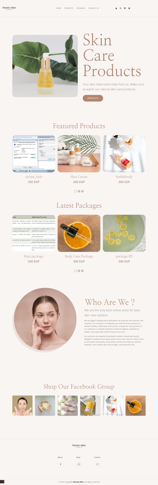
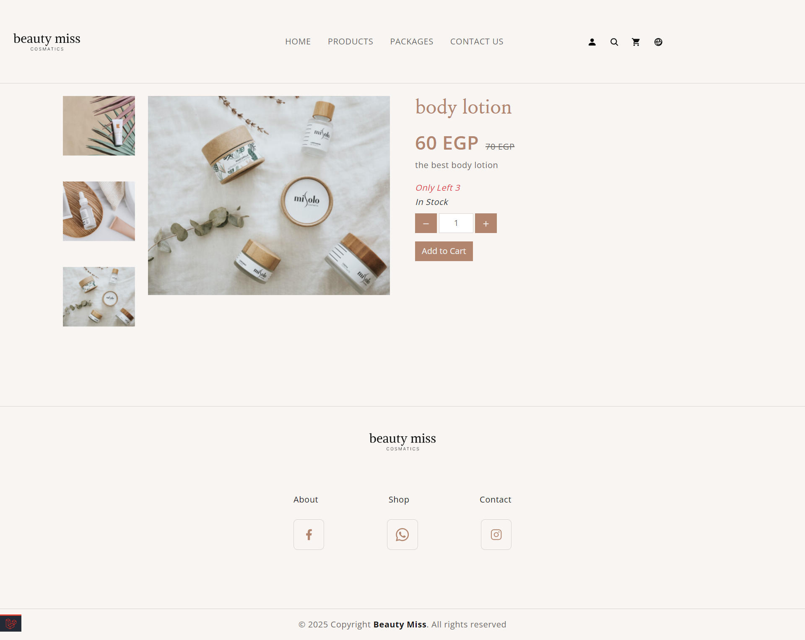
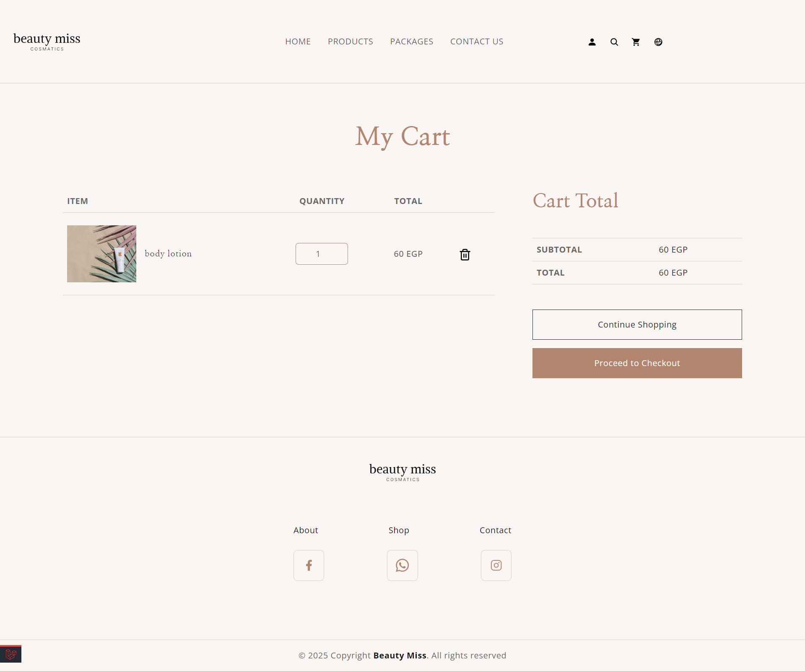
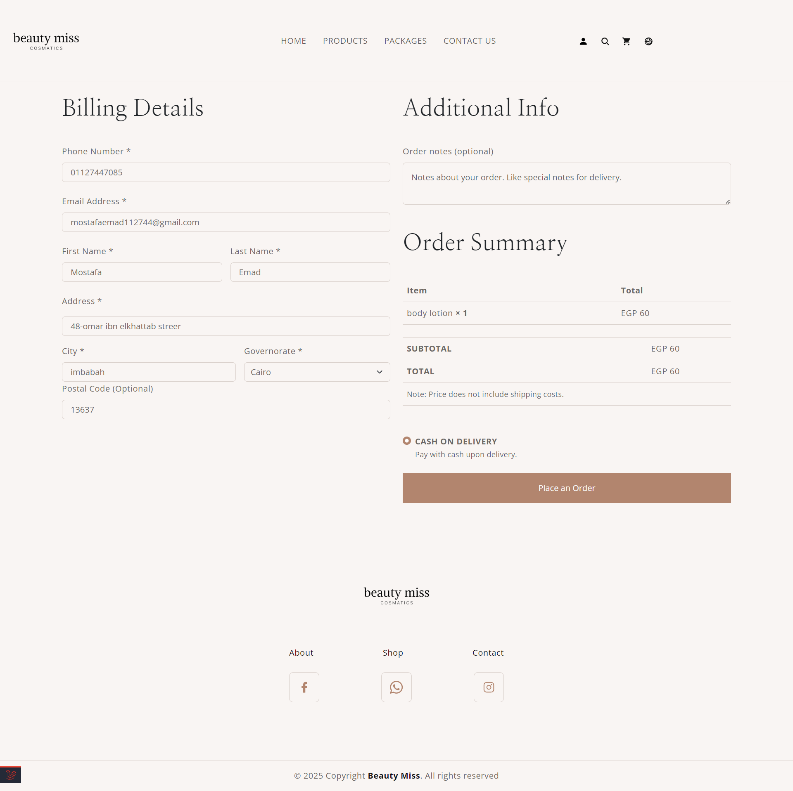
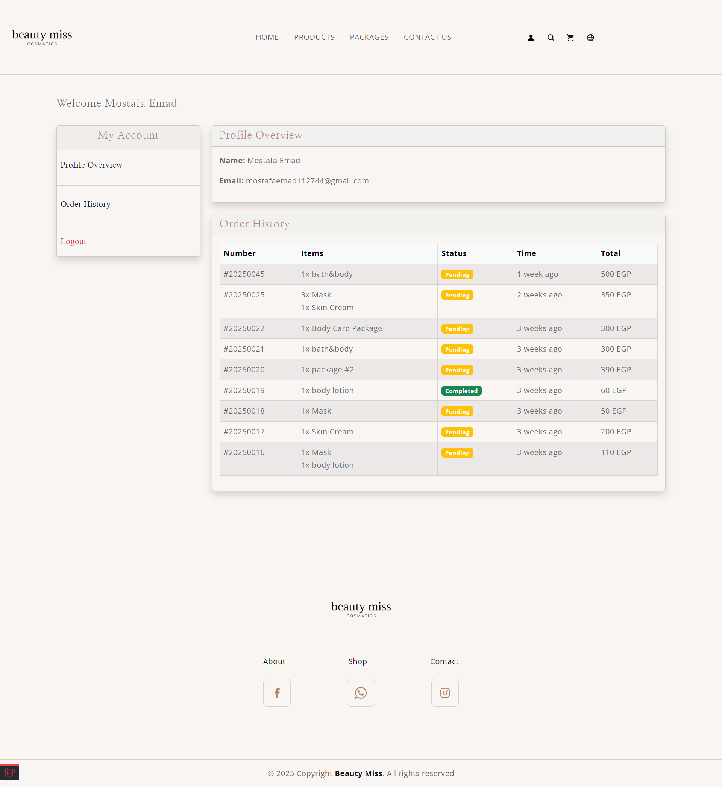
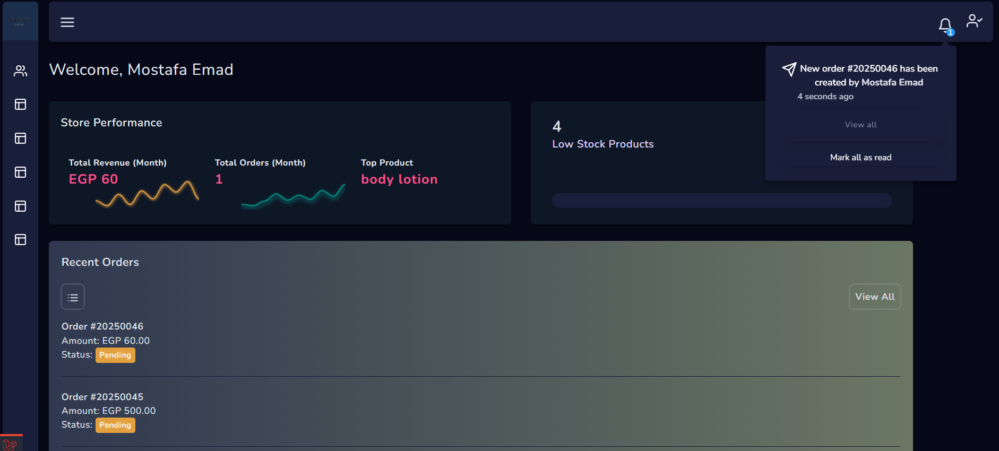

# Beauty-Miss E-commerce Platform 🛍️

Beauty-Miss is an e-commerce platform built with Laravel, focused on selling skin care products and beauty packages. The platform provides essential shopping features for customers and an administrative dashboard for business management.

## ✨ Core Features

### Customer Features

- **Authentication & Authorization**

  - User registration and login
  - Password reset
  - User profiles
  - Tracking Orders
  - Multi-Language Support

- **Shopping Features**

  - Browse skin care products
  - View product details
  - Shopping cart functionality
  - Checkout process
  - products and packages search

- **Product Management**
  - Product categories
  - Product filtering
  - Product details with images

### Admin Dashboard

- **Management Features**
  - Products and packages management
  - Order management
  - User management
  - Basic statistics
  - Notifications system

## 🔧 Technical Stack

- **Framework:** Laravel
- **Database:** MySQL
- **Frontend:** HTML, CSS, JavaScript
- **Additional:** Bootstrap, jQuery

## 📸 Project Screenshots

#### Home Page

#### Products Page

#### Sngle Product

#### Shopping Cart

_User-friendly shopping cart interface_

#### Checkout

_Streamlined checkout process_

#### Profile

### Admin Dashboard

